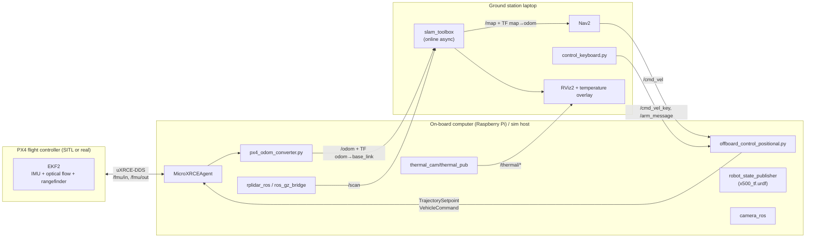

# Autonomous Indoor Thermal Surveying and LiDAR-based SLAM for UAVs

ROS 2 workspace for a low-cost autonomous quadcopter that flies indoors **without GPS**. It maps the building with a 2D LiDAR, follows planned paths, and finds heat sources with a thermal camera. The same code runs in a Gazebo simulation and on the real drone.

📘 **Thesis:** [Autonomous Indoor Thermal Surveying and LiDAR-based Simultaneous Localization and Mapping for Unmanned Aerial Vehicles](https://drive.google.com/file/d/1je-og2tN93wE13JT9YaWHDui7SlkzIIq/view)

> **Abstract.** This project developed a low-cost autonomous quadcopter capable of navigating and operating indoors without GPS. Using open-source software, a laser scanner, optical flow and distance sensors, and a thermal camera, the drone can map indoor environments, maintain stable flight, follow planned paths, and detect heat sources in real time. Tests in both simulation and real-world settings showed reliable navigation, accurate mapping, and effective thermal surveying, with best performance at lower altitudes.

---

## Contents

1. [System overview](#system-overview)
2. [Software stack](#software-stack)
3. [Installation](#installation)
4. [Flight controller parameters](#flight-controller-parameters)
5. [Running](#running)
6. [Repository structure](#repository-structure)
7. [How it works (per node)](#how-it-works)
8. [Configuration files](#configuration-files)
9. [Known issues](#known-issues)
10. [Resources](#resources)

---

## System overview



- **Localization for flight** is done by PX4's EKF2 using optical flow, a downward rangefinder and the IMU. There is no GPS and no magnetometer.
- **Mapping** is done by `slam_toolbox` from the 2D LiDAR scan plus the odometry from PX4.
- **Navigation**: Nav2 plans on the SLAM map and publishes `/cmd_vel`. The offboard controller turns that into PX4 position and velocity setpoints.
- **Thermal surveying**: the MLX90640 (32×24 px) publishes a raw temperature image, a colour-mapped image and the current maximum temperature. RViz shows the maximum temperature as a text overlay.

### TF tree

```
map ──(slam_toolbox)──▶ odom ──(px4_odom_converter)──▶ base_link ─┬─(URDF)──▶ laser        (z = 0.26 m)
                                                                  └─(URDF)──▶ base_footprint
```

---

## Software stack

This is the same stack as [jubaer-emon/drone](https://github.com/jubaer-emon/drone):

| Component | Version | Used for |
| --- | --- | --- |
| Ubuntu | 22.04 LTS (native or [WSL2](https://docs.px4.io/main/en/dev_setup/dev_env_windows_wsl)) | Host OS for the GCS/sim and the Raspberry Pi |
| [ROS 2](https://docs.ros.org/en/humble/Installation.html) | Humble | Middleware |
| [Gazebo](https://gazebosim.org/docs/harmonic/ros_installation/) | Harmonic | Simulation |
| [PX4 Autopilot](https://docs.px4.io/main/en/dev_setup/building_px4) | v1.16 | Flight stack (SITL and real FC) |
| [px4_msgs](https://github.com/PX4/px4_msgs) | Submodule, pinned to a July 2025 `main` commit (≈ v1.16) | PX4 ↔ ROS 2 message definitions |
| [Micro XRCE-DDS Agent](https://docs.px4.io/main/en/middleware/uxrce_dds.html#micro-xrce-dds-agent-installation) | v2.x | Bridge between PX4 uORB and ROS 2 |
| [slam_toolbox](https://github.com/SteveMacenski/slam_toolbox) | Humble | 2D SLAM |
| [Nav2](https://docs.nav2.org/) | Humble | Path planning / following |
| [rplidar_ros](https://github.com/Slamtec/rplidar_ros) | Submodule (`ros2` branch) | RPLIDAR A1 driver (real drone) |
| [camera_ros](https://github.com/christianrauch/camera_ros) | Humble | Raspberry Pi camera (OV5647) driver (real drone) |
| [rviz_2d_overlay_plugins](https://github.com/teamspatzenhirn/rviz_2d_overlay_plugins) | Humble | Max-temperature overlay in RViz |
| [QGroundControl](https://docs.qgroundcontrol.com/master/en/qgc-user-guide/getting_started/download_and_install.html) | latest | FC parameters, calibration, monitoring |

---

## Installation

The start scripts assume the workspace is at **`~/ws_offboard_control`**.

### 1. ROS 2, Gazebo, PX4 (ground station / simulation PC)

Follow the official guides:

- ROS 2 Humble: <https://docs.ros.org/en/humble/Installation/Ubuntu-Install-Debians.html>
- PX4 + ROS 2 user guide: <https://docs.px4.io/main/en/ros2/user_guide>
- Gazebo Harmonic with ROS 2 Humble: <https://gazebosim.org/docs/harmonic/ros_installation/>

PX4 SITL (the sim launch expects it at `~/PX4-Autopilot`):

```bash
cd ~
git clone https://github.com/PX4/PX4-Autopilot.git --recursive -b v1.16.0
bash ./PX4-Autopilot/Tools/setup/ubuntu.sh
cd PX4-Autopilot && make px4_sitl        # first build
```

Micro XRCE-DDS Agent:

```bash
cd ~
git clone -b v2.4.3 https://github.com/eProsima/Micro-XRCE-DDS-Agent.git
cd Micro-XRCE-DDS-Agent && mkdir build && cd build
cmake .. && make && sudo make install && sudo ldconfig /usr/local/lib/
```

ROS packages and tools:

```bash
sudo apt install \
  ros-humble-slam-toolbox ros-humble-navigation2 ros-humble-nav2-bringup \
  ros-humble-ros-gzharmonic ros-humble-robot-state-publisher \
  ros-humble-rviz-2d-overlay-plugins \
  tmux gnome-terminal python3-scipy python3-numpy python3-pynput
```

Install [QGroundControl](https://docs.qgroundcontrol.com/master/en/qgc-user-guide/getting_started/download_and_install.html) as well.

### 2. On-board computer (Raspberry Pi, real drone only)

Install ROS 2 Humble (base is enough) and the Micro XRCE-DDS Agent as above. Then:

```bash
sudo apt install ros-humble-camera-ros ros-humble-cv-bridge python3-opencv \
                 ros-humble-robot-state-publisher ros-humble-slam-toolbox ros-humble-navigation2 ros-humble-nav2-bringup
pip install adafruit-circuitpython-mlx90640 adafruit-blinka   # MLX90640 over I2C
```

Enable I2C (`sudo raspi-config` → Interface Options) and the serial port to the flight controller (`/dev/serial0`, 921600 baud).

### 3. Clone and build this workspace (both machines)

```bash
git clone --recurse-submodules https://github.com/mashmahmood/ws_offboard_control.git ~/ws_offboard_control
cd ~/ws_offboard_control
source /opt/ros/humble/setup.bash
colcon build --symlink-install
source install/setup.bash
```

If you cloned without `--recurse-submodules`, run `git submodule update --init` to fetch `px4_msgs` and `rplidar_ros`.

> `px4_msgs` must match the PX4 firmware version. If you use a different PX4 release, check out the matching `release/x.y` branch in `src/px4_msgs`.

On the GCS, `thermal_cam` needs the Adafruit/board libraries. If you don't want them there, skip the package: `colcon build --packages-skip thermal_cam`.

### 4. Simulation assets (PX4 side)

The sim launch runs `PX4_GZ_WORLD=turtle_world make px4_sitl gz_x500_lidar_2d` and bridges the Gazebo topic **`/scan`** to ROS. Two changes are needed in `PX4-Autopilot/Tools/simulation/gz/`, and neither is included in this repo:

1. Add an indoor world `worlds/turtle_world.sdf` (for example, a TurtleBot3 world converted to Gazebo Harmonic), or change `PX4_GZ_WORLD` in [`processes.py`](src/px4_ros_com/src/offboard_control/processes.py) to a world you have.
2. In `models/lidar_2d_v2/model.sdf`, set the lidar sensor's `<topic>scan</topic>` and `<gz_frame_id>laser</gz_frame_id>`. This makes the scan arrive on `/scan` with the `laser` frame from the URDF.

### 5. Networking (real drone)

The Raspberry Pi runs a Wi-Fi hotspot, and the GCS connects to it (the Pi is `10.42.0.1`, user `firedrone`). Use the same `ROS_DOMAIN_ID` on both machines:

```bash
echo "source /opt/ros/humble/setup.bash" >> ~/.bashrc
echo "export ROS_DOMAIN_ID=0" >> ~/.bashrc
```

Set up SSH keys so that `ssh firedrone@10.42.0.1` works without a password (`ssh-copy-id firedrone@10.42.0.1`).

---

## Flight controller parameters

Set these in QGroundControl for GPS-denied indoor flight (from [jubaer-emon/drone](https://github.com/jubaer-emon/drone)):

| Parameter | Value | Description |
| --- | --- | --- |
| `COM_RC_IN_MODE` | 5 | RC > MAVLink for manual control |
| `COM_RC_OVERRIDE` | 3 | Allow RC override during offboard |
| `COM_OBL_RC_ACT` | 3 | Return mode on RC signal issue |
| `NAV_DLL_ACT` | 2 | Return mode on GCS link loss |
| `RTL_RETURN_ALT` | 2.0 | Safe indoor return height |
| `EKF2_GPS_CTRL` | 0 | Disable GPS |
| `EKF2_BARO_CTRL` | 1 | Barometer fusion |
| `EKF2_RNG_CTRL` | 1 | Conditional rangefinder fusion |
| `EKF2_HGT_REF` | 2 | Rangefinder as height reference |
| `EKF2_OF_CTRL` | 1 | Fuse optical flow |
| `EKF2_MAG_TYPE` | 5 | Ignore magnetometer |
| `SENS_IMU_MODE` | 0 | Pass both raw IMU streams |
| `EKF2_MULTI_IMU` | 2 (1 in sim) | Multi-IMU EKF |
| `EKF2_OF_POS_X/Y/Z` | 0.2, 0.0, 0.2 | Optical flow sensor position |
| `UXRCE_DDS_SYNCT` | 1 (0 in sim) | uXRCE-DDS time sync |
| `COM_ARM_WO_GPS` | 2 | Allow arming without GPS |
| `MPC_ALT_MODE` | 0 | Fixed altitude (no terrain following) |
| `SYS_HAS_MAG` / `SYS_HAS_GPS` | 0 / 0 | No magnetometer / GPS |

More tuning notes: [Using PX4's EKF2](https://docs.px4.io/main/en/advanced_config/tuning_the_ecl_ekf#using-px4-s-navigation-filter-ekf2), [indoor configuration](https://docs.px4.io/main/en/advanced_config/tuning_the_ecl_ekf#typical-configurations).

**Preflight check:** with the drone on the floor, open the QGC MAVLink Inspector and check that `LOCAL_POSITION_NED` matches reality before you fly.

---

## Running

Everything starts from **one script**. Each script opens a `tmux` session (`px4_sim`) with 4 panes:

| Pane | `start_sim.sh` | `start_real.sh` |
| --- | --- | --- |
| 0 | `offboard_control.launch.py`: PX4 SITL + Gazebo + agent + controller + Nav2 | Runs `offboard_control_drone.launch.py` **on the drone over SSH** |
| 1 | `control_keyboard.py` (teleop / arm) | same |
| 2 | `offboard_control_slam.launch.py use_sim:=True`: slam_toolbox + Nav2 | same with `use_sim:=False` |
| 3 | `offboard_control_gcs.launch.py`: RViz + thermal overlay | same |

### Simulation

```bash
cd ~/ws_offboard_control
./start_sim.sh
```

PX4 SITL/Gazebo and the XRCE agent open in separate `gnome-terminal` tabs. The script waits 20 s for them to come up before it starts the other panes.

### Real drone

1. Power the drone and connect the GCS to its Wi-Fi hotspot.
2. Open QGroundControl and check the sensors and EKF.
3. Run:

```bash
cd ~/ws_offboard_control
./start_real.sh
```

### Flying

Click into the **keyboard pane** (pane 1):

| Key | Action |
| --- | --- |
| `SPACE` | Arm → automatic offboard takeoff to 1 m. Press again to land and disarm |
| `W` / `S` | Up / down |
| `A` / `D` | Yaw left / right |
| Arrow keys | Move forward / back / left / right (0.4 m/s) |
| `M` | Toggle mouse mode (mouse movement drives horizontal velocity) |
| `O` | Re-request PX4 offboard mode (e.g. after an RC override) |
| `Ctrl-C` | Quit teleop (sends zero velocity) |

After takeoff and a 3 s stabilisation period, send goals from RViz (**Nav2 Goal** or **Waypoint** mode). Nav2's `/cmd_vel` and the keyboard's velocities are added together, so you can always nudge the drone by hand.

Lock the flight altitude (optional):

```bash
ros2 topic pub -t 3 --qos-durability transient_local --qos-reliability best_effort \
  /takeoff_height std_msgs/msg/Float64 "{data: 1.5}"
```

Thermal data: add an **Image** display on `/thermal/rgb` in RViz, and a **TextOverlay** display (from `rviz_2d_overlay_plugins`) on the overlay topic published by `string_to_overlay_text_1` for the live max temperature.

Save the map: `ros2 run nav2_map_server map_saver_cli -f ~/map`.

---

## Repository structure

```
ws_offboard_control/
├── start_sim.sh                  # One-command simulation bringup (tmux)
├── start_real.sh                 # One-command real-drone bringup (tmux + SSH)
└── src/
    ├── px4_msgs/                 # submodule – PX4 ROS 2 message definitions
    ├── rplidar_ros/              # submodule – RPLIDAR driver (real drone)
    ├── px4_ros_com/              # main package (ament_cmake, Python nodes)
    │   ├── launch/
    │   │   ├── offboard_control.launch.py        # SIM: PX4 SITL, gz bridge, controller, odom, Nav2
    │   │   ├── offboard_control_drone.launch.py  # REAL (on drone): agent, lidar, camera, thermal, controller, odom
    │   │   ├── offboard_control_slam.launch.py   # GCS: slam_toolbox + Nav2 (use_sim arg)
    │   │   └── offboard_control_gcs.launch.py    # GCS: RViz + temperature overlay
    │   ├── config/
    │   │   ├── mapper_params_online_async.yaml   # slam_toolbox parameters
    │   │   └── nav2_params.yaml                  # Nav2 parameters
    │   └── src/
    │       ├── offboard_control/
    │       │   ├── offboard_control_positional.py  # Offboard state machine + setpoints
    │       │   ├── control_keyboard.py             # Keyboard/mouse teleop, arm toggle
    │       │   ├── px4_odom_converter.py           # PX4 NED/FRD odometry → ROS ENU/FLU /odom + TF
    │       │   ├── processes.py                    # Starts MicroXRCEAgent + PX4 SITL (sim)
    │       │   └── slam_to_px4.py                  # (optional, not launched) SLAM pose → PX4 visual odometry
    │       └── services/
    │           └── slam_service.py                 # /toggle_slam service: start/stop slam_toolbox
    ├── thermal_cam/              # ament_python package – MLX90640 publisher
    │   └── thermal_cam/thermal_pub.py
    └── x500_description/         # Static TF (URDF) for base_link → laser / base_footprint
        └── urdf/x500_tf.urdf
```

---

## How it works

### `offboard_control_positional.py`: offboard controller

This is the core flight node. It runs a 10 Hz state machine and always publishes the `OffboardControlMode` heartbeat (position + velocity).

```
IDLE ──SPACE & preflight OK──▶ ARMING ──armed & 50 setpoints sent──▶ OFFBOARD_TAKEOFF
  ▲                                                                        │ reached takeoff height
  │                                                                        ▼
  └──── disarmed ◀── LANDING ◀── SPACE / failsafe / check failed ── OFFBOARD_FLYING
```

- **Takeoff**: position setpoint above the takeoff XY point at `1.0 m` plus the current height, with a 0.7 m/s climb velocity feed-forward.
- **Flying**: for 3 s after takeoff it holds the takeoff position. After that it adds the keyboard and Nav2 velocities, rotates them by the current yaw into PX4's local NED frame, and sends a `TrajectorySetpoint` with *position = last held position + velocity* and *velocity = feed-forward*. When the commanded velocity is ~0, the last position is held, which keeps drift low with optical flow. If `/takeoff_height` was received, Z is locked to it.
- **Landing**: `VEHICLE_CMD_NAV_LAND`. When PX4 reports landed, the node disarms and resets.

| Direction | Topic | Type |
| --- | --- | --- |
| Sub | `/fmu/out/vehicle_local_position`, `/fmu/out/vehicle_status_v1`, `/fmu/out/vehicle_attitude`, `/fmu/out/vehicle_land_detected` | `px4_msgs` |
| Sub | `/cmd_vel` (Nav2), `/cmd_vel_key` (keyboard) | `geometry_msgs/Twist` |
| Sub | `/arm_message` | `std_msgs/Bool` |
| Sub | `/takeoff_height` | `std_msgs/Float64` |
| Pub | `/fmu/in/offboard_control_mode`, `/fmu/in/trajectory_setpoint`, `/fmu/in/vehicle_command` | `px4_msgs` |

### `control_keyboard.py`: teleop

Reads raw keys from the terminal (and the mouse via `pynput`, so it needs a desktop session). It publishes `/cmd_vel_key` (Twist, max 0.8 m/s) and toggles `/arm_message` on `SPACE`.

### `px4_odom_converter.py`: odometry bridge

Subscribes to `/fmu/out/vehicle_odometry` and converts PX4's NED world / FRD body frames to ROS ENU / FLU (position, velocity, quaternion, angular rate). It publishes `nav_msgs/Odometry` on `/odom` and broadcasts TF `odom → base_link`. slam_toolbox and Nav2 use this as their odometry source.

### `processes.py` (simulation only)

Opens `gnome-terminal` tabs that run `MicroXRCEAgent udp4 -p 8888` and `PX4_GZ_WORLD=turtle_world make px4_sitl gz_x500_lidar_2d` from `~/PX4-Autopilot`.

### `slam_service.py`: SLAM toggle

Provides the `std_srvs/Trigger` service `/toggle_slam`, which starts or stops `slam_toolbox` with this repo's parameters as a subprocess. It is meant to be triggered from a dashboard such as Foxglove: `ros2 service call /toggle_slam std_srvs/srv/Trigger`.

### `slam_to_px4.py` (optional, not launched)

Experimental: reads the `map → base_link` TF and publishes it to `/fmu/in/vehicle_visual_odometry`, so PX4 can fuse the SLAM pose as external vision. It is commented out in `offboard_control_slam.launch.py`. The thesis flights used optical flow instead.

### `thermal_cam/thermal_pub.py`: thermal camera

Reads the MLX90640 over I2C at 2 Hz and publishes:

| Topic | Type | Content |
| --- | --- | --- |
| `/thermal/temperature` | `sensor_msgs/Image` (`32FC1`, 32×24) | Raw temperatures in °C |
| `/thermal/rgb` | `sensor_msgs/Image` (`bgr8`, 128×96) | Bicubic ×4 upscale, JET colour map |
| `/thermal/max_temp` | `std_msgs/String` | `"Max Temp: xx.x°C"`, shown as an RViz overlay |

### `x500_description`

A minimal URDF with no meshes that `robot_state_publisher` loads for the static transforms `base_link → laser` (LiDAR 0.26 m above the base) and `base_link → base_footprint`.

### Launch files in detail

| Launch file | Runs on | Starts |
| --- | --- | --- |
| `offboard_control.launch.py` | Sim PC | `processes.py`, controller, `robot_state_publisher`, odom converter, `ros_gz_bridge` (`/scan`, `/clock`), `slam_service`, Nav2. Sets `use_sim_time:=true` |
| `offboard_control_drone.launch.py` | Raspberry Pi | `MicroXRCEAgent serial /dev/serial0 @921600`, `rplidar_a1_launch.py`, `camera_ros` (OV5647, 160×120), controller, `robot_state_publisher`, odom converter, `slam_service`, `thermal_pub` |
| `offboard_control_slam.launch.py` | GCS | `slam_toolbox` online async + Nav2. Argument `use_sim` (default `False`) |
| `offboard_control_gcs.launch.py` | GCS | RViz (Nav2 default view), `string_to_overlay_text` for `/thermal/max_temp` |

---

## Configuration files

- **`config/mapper_params_online_async.yaml`** (slam_toolbox): mapping mode, `odom`/`map` frames, `base_frame: laser`, scan topic `/scan`, 5 cm resolution, 1 s map updates, 0.1 m / 0.1 rad travel thresholds, loop closing enabled.
- **`config/nav2_params.yaml`** (Nav2): NavFn global planner, DWB local controller (`max_vel_x` 0.26 m/s), `robot_radius` 0.3 m, obstacle/voxel layers from `/scan`, static layer from the SLAM `/map`, odometry from `/odom`.

---

## Known issues

- In simulation, **Nav2 is launched twice**: by `offboard_control.launch.py` and again by `offboard_control_slam.launch.py`. The copy in the SLAM launch does not pass `use_sim_time`.
- The start scripts hard-code `~/ws_offboard_control`, the SSH target `firedrone@10.42.0.1`, and `gnome-terminal`.
- Position accuracy drops at higher altitude because of optical flow limits. This matches the thesis results.

---

## Resources

- Thesis PDF: <https://drive.google.com/file/d/1je-og2tN93wE13JT9YaWHDui7SlkzIIq/view>
- Reference setup (same stack, FC parameters): <https://github.com/jubaer-emon/drone>
- PX4 ROS 2 user guide: <https://docs.px4.io/main/en/ros2/user_guide>
- PX4 offboard mode: <https://docs.px4.io/main/en/flight_modes/offboard>
- uXRCE-DDS bridge: <https://docs.px4.io/main/en/middleware/uxrce_dds.html>
- slam_toolbox: <https://github.com/SteveMacenski/slam_toolbox>
- Nav2: <https://docs.nav2.org/>
- MLX90640 CircuitPython driver: <https://github.com/adafruit/Adafruit_CircuitPython_MLX90640>
